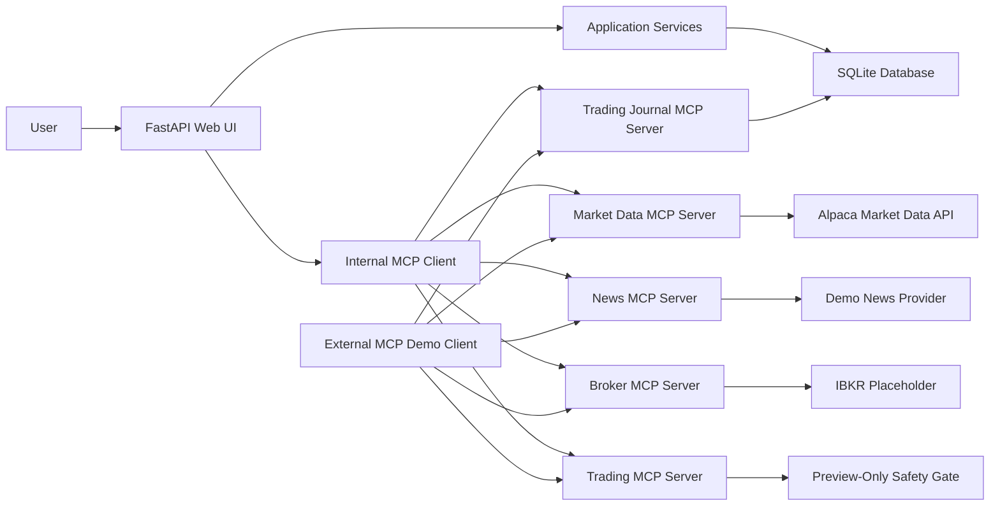

# Trading Journal MCP

Trading Journal MCP is a Python/FastAPI portfolio and trade-journaling application built as a practical Model Context Protocol (MCP) use case. The current codebase is the accepted prototype for a graduate project and is now being evolved into the full application.

The app helps track accounts, holdings, manual trades, open positions, closed positions, realized profit/loss, unrealized profit/loss, and the reason behind every trade. It also exposes portfolio and market-data capabilities through MCP servers so external clients can discover and call application features in a standard way.

## Project Goals

- Build a day-to-day trading journal for portfolio review and trade reasoning.
- Demonstrate MCP concepts using a real financial application instead of a toy example.
- Support multiple asset classes such as stocks, ETFs, mutual funds, bonds, options, and cash.
- Track realized and unrealized P&L across accounts and asset classes.
- Show how an application can act as both an MCP server and an MCP client.
- Prepare for future IBKR broker sync, stock news, order staging, paper trading, and safe live-trading workflows.

## Prototype Features Included

- FastAPI backend with server-rendered HTML pages.
- SQLite-backed local database.
- Default accounts for `IBKR Live` and `Manual Fidelity`.
- Manual import flow for existing holdings.
- Manual buy/sell trade entry.
- Required trade reason field for every manual trade.
- Position updates using average-cost accounting.
- Partial close and full close behavior.
- Closed positions page with realized P&L.
- Manual mark-price updates for unrealized P&L.
- Dashboard P&L tables for overall, account-level, and account plus asset-class reporting.
- Market-data page for portfolio symbols.
- Alpaca-backed market-data integration for supported stocks, ETFs, and options.
- Trading Journal MCP server.
- Market Data MCP server.
- Safe News MCP, Broker MCP, and Trading MCP scaffolding for future phases.
- Internal MCP client calls from the web app to the Market Data MCP server.
- External command-line MCP demo client.
- Planning documents for requirements, implementation, deployment, and prototype baseline.

## Current Architecture



## Repository Structure

```text
.
├── app/
│   ├── main.py                 # FastAPI app factory, routers, mounted MCP servers
│   ├── config.py               # Environment-based settings
│   ├── db.py                   # SQLAlchemy database setup
│   ├── mcp_server.py           # Trading Journal MCP server
│   ├── market_data_mcp.py      # Market Data MCP server
│   ├── audit/                  # Audit event scaffolding
│   ├── models/                 # SQLAlchemy entities and enums
│   ├── mcp_servers/            # Domain-specific MCP server factories
│   ├── providers/              # External provider adapter interfaces
│   ├── routes/                 # Web and JSON API route modules
│   ├── services/               # Portfolio, market data, and MCP host logic
│   ├── static/                 # CSS
│   └── templates/              # Jinja2 HTML templates
├── docs/
│   ├── application_requirements.md
│   ├── architecture_plan.md
│   ├── deployment_plan.md
│   ├── implementation_plan.md
│   ├── prototype_baseline.md
│   └── proposal/
│       ├── Trading_Journal_MCP_Proposal_Revised.docx
│       └── Trading_Journal_MCP_Proposal_Revised.pdf
├── scripts/
│   └── mcp_demo_client.py      # External MCP client demo
├── tests/
│   ├── test_trade_flow.py
│   └── test_mcp_flow.py
├── tools/
│   └── build_revised_proposal.py
├── PROPOSAL.md
├── pyproject.toml
└── README.md
```

## Prerequisites

- Python 3.12 or newer.
- Git.
- Optional Alpaca paper-trading/market-data API keys if you want live market data.

The app can run without Alpaca keys, but live quote calls will show a configuration warning until keys are set.

## Download The Project

Clone the repository:

```bash
git clone https://github.com/thejavascriptways/IFSC-78603-Graduate-Project-trading_journal-mcp.git
cd IFSC-78603-Graduate-Project-trading_journal-mcp
```

## Local Setup

Create and activate a virtual environment:

```bash
python3 -m venv .venv
source .venv/bin/activate
```

Install the application with development dependencies:

```bash
python3 -m pip install --upgrade pip
python3 -m pip install -e ".[dev]"
```

## Optional Market Data Setup

Set Alpaca credentials if you want the market-data page and Market Data MCP server to call Alpaca:

```bash
export ALPACA_API_KEY_ID="your-key-id"
export ALPACA_API_SECRET_KEY="your-secret-key"
export ALPACA_STOCK_FEED="iex"
export ALPACA_OPTION_FEED="indicative"
```

If you have paid real-time data entitlements, you can change the feeds:

```bash
export ALPACA_STOCK_FEED="sip"
export ALPACA_OPTION_FEED="opra"
```

Asset-class notes:

- Stocks and ETFs can use Alpaca stock feeds.
- Options require appropriate options-data entitlement for true OPRA quotes.
- Mutual funds usually publish NAV once per business day rather than live intraday quotes.
- Bonds are not covered by Alpaca stock/options quote feeds.

## Run The Web App

Start the local server:

```bash
uvicorn app.main:app --reload
```

Open the app:

```text
http://127.0.0.1:8000/
```

If `--reload` causes a permission issue on macOS or in a restricted environment, run without reload:

```bash
uvicorn app.main:app
```

## How To Use The Current App

1. Open the dashboard at `http://127.0.0.1:8000/`.
2. Use **Import Holdings** to manually add existing Fidelity or other manual holdings.
3. Use **Add Trade** to manually record buy or sell trades.
4. Enter a clear trade reason. The app requires this field.
5. Use **Positions** to review open holdings, update mark prices, refresh market data, or close positions.
6. Use **Closed Positions** to review realized P&L after a position is fully closed.
7. Use **Market Data** to view quote data and provider status for portfolio symbols.
8. Use **MCP Console** to discover MCP servers, call tools, read resources, and render prompts from the browser.
9. Use the MCP demo client to show how external clients discover and call MCP capabilities.

## MCP Endpoints

The app currently mounts five MCP servers:

```text
Trading Journal MCP: http://127.0.0.1:8000/mcp/
Market Data MCP:     http://127.0.0.1:8000/market-data-mcp/
News MCP:            http://127.0.0.1:8000/news-mcp/
Broker MCP:          http://127.0.0.1:8000/broker-mcp/
Trading MCP:         http://127.0.0.1:8000/trading-mcp/
```

### Trading Journal MCP Server

Current tools:

- `get_portfolio_summary`
- `list_accounts`
- `list_positions`
- `list_trades`
- `add_opening_holding`
- `add_manual_trade`

Current resources:

- `portfolio://summary`
- `portfolio://positions`

Current prompts:

- `daily_portfolio_review`
- `journal_follow_up`

### Market Data MCP Server

Current tools:

- `get_market_data_capabilities`
- `get_equity_snapshots`
- `get_option_snapshots`

Current resources:

- `market-data://capabilities`

Current prompts:

- `market_data_health_check`

### News MCP Server

Current tools:

- `get_news_capabilities`
- `get_symbol_news`
- `get_portfolio_news`

Current resources:

- `news://capabilities`

Current prompts:

- `portfolio_news_review`

This server currently uses deterministic demo news data so the architecture can be demonstrated before a real news provider is selected.

### Broker MCP Server

Current tools:

- `get_broker_status`
- `list_broker_accounts`

Current resources:

- `broker://status`

Current prompts:

- `broker_sync_readiness`

This server is safe scaffolding for future IBKR sync. It does not connect to IBKR or place trades yet.

### Trading MCP Server

Current tools:

- `get_trading_capabilities`
- `preview_order`

Current resources:

- `trading://capabilities`

Current prompts:

- `order_safety_review`

This server only supports preview scaffolding. Live trading is disabled.

## Demonstrate MCP From The Command Line

Run these commands after the web app is running.

Explain what the demo client shows:

```bash
python3 scripts/mcp_demo_client.py explain
```

List MCP servers exposed by the app:

```bash
python3 scripts/mcp_demo_client.py servers
```

Discover the Trading Journal MCP server:

```bash
python3 scripts/mcp_demo_client.py discover
python3 scripts/mcp_demo_client.py tools
python3 scripts/mcp_demo_client.py resources
python3 scripts/mcp_demo_client.py prompts
```

Call portfolio tools and resources:

```bash
python3 scripts/mcp_demo_client.py summary
python3 scripts/mcp_demo_client.py call list_positions --arguments '{"symbol":"VOO"}'
python3 scripts/mcp_demo_client.py read-resource portfolio://summary
python3 scripts/mcp_demo_client.py get-prompt daily_portfolio_review --arguments '{"focus":"risk"}'
```

Run a guided portfolio review:

```bash
python3 scripts/mcp_demo_client.py portfolio-review --focus risk
```

Discover the Market Data MCP server:

```bash
python3 scripts/mcp_demo_client.py --server market discover
python3 scripts/mcp_demo_client.py --server market tools
python3 scripts/mcp_demo_client.py --server market resources
python3 scripts/mcp_demo_client.py --server market prompts
```

Discover the future domain MCP scaffolds:

```bash
python3 scripts/mcp_demo_client.py --server news discover
python3 scripts/mcp_demo_client.py --server broker discover
python3 scripts/mcp_demo_client.py --server trading discover
python3 scripts/mcp_demo_client.py --server trading call get_trading_capabilities
```

Call market-data tools:

```bash
python3 scripts/mcp_demo_client.py --server market call get_market_data_capabilities
python3 scripts/mcp_demo_client.py --server market call get_equity_snapshots --arguments '{"symbols":["AAPL","MSFT"]}'
python3 scripts/mcp_demo_client.py --server market read-resource market-data://capabilities
python3 scripts/mcp_demo_client.py --server market get-prompt market_data_health_check --arguments '{"symbols":"AAPL,MSFT"}'
```

Run a guided market-data check:

```bash
python3 scripts/mcp_demo_client.py market-check --symbols AAPL,MSFT
```

Run the complete multi-server demo:

```bash
python3 scripts/mcp_demo_client.py client-demo
```

The CLI also supports a remote base URL, which will be useful after deployment:

```bash
python3 scripts/mcp_demo_client.py --base-url https://your-demo-url.example discover
```

## Run Tests

Run the automated test suite:

```bash
python3 -m pytest
```

Current baseline result at prototype freeze:

```text
10 passed
```

The tests cover:

- Manual trade position updates.
- Required trade reason validation.
- Opening holding imports.
- Duplicate import rejection.
- Partial sell and full close behavior.
- Realized and unrealized P&L.
- Dashboard P&L summaries.
- Trading Journal MCP discovery and tool calls.
- Market Data MCP discovery and capability calls.
- News, Broker, and Trading MCP scaffold discovery.
- Trading MCP live-trading-disabled safety signal.
- Browser MCP Console route and catalog API.

## Important Safety Notes

This is a prototype/graduate-project application, not a production trading system.

- Do not commit `.env` files or API keys.
- Do not commit local SQLite databases.
- Do not use real broker credentials in a public demo environment.
- Live trading is not implemented in the current prototype.
- Future live trading must require explicit user confirmation, audit logging, and safety gates.
- Public professor demos should use sample data and simulated/paper trading only.

## Planning Documents

The project roadmap is documented in:

- [Accepted Revised Final Proposal - PDF](docs/proposal/Trading_Journal_MCP_Proposal_Revised.pdf)
- [Accepted Revised Final Proposal - Word](docs/proposal/Trading_Journal_MCP_Proposal_Revised.docx)
- [Application Requirements](docs/application_requirements.md)
- [Architecture Plan](docs/architecture_plan.md)
- [Implementation Plan](docs/implementation_plan.md)
- [Deployment Plan](docs/deployment_plan.md)
- [Prototype Baseline](docs/prototype_baseline.md)

`PROPOSAL.md` is the earlier short proposal draft. The revised final proposal accepted by the professor is stored under `docs/proposal/`.

## Recommended Next Build Step

The next implementation step is to add the real application foundation:

1. Expanded data models for audit events, news, broker connections, and order tickets.
2. Correlation ID middleware.
3. Full audit logging for user actions, MCP requests, external API calls, and errors.
4. Audit log viewer screen.
5. Tests for audit creation and secret redaction.

This foundation should be completed before IBKR broker sync, paper trading, or any future live trading workflow.
