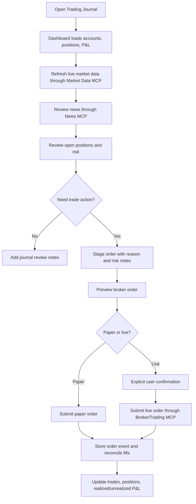
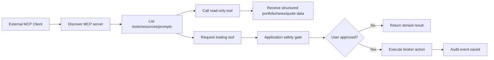

# Trading Journal MCP Application Requirements

## 1. Purpose

The accepted proposal treated the current Trading Journal codebase as a prototype. The next phase is to build the actual application: a full-fledged Python-based trading journal and MCP system for portfolio tracking, trade journaling, market data, stock news, broker connectivity, and controlled trade execution.

The application has two equally important goals:

1. Provide a practical day-to-day trading journal that is easy to use for tracking holdings, decisions, realized P&L, unrealized P&L, stock news, and trading activity.
2. Serve as a strong MCP learning project by exposing portfolio, market-data, news, analytics, and trading capabilities through clear MCP servers and by demonstrating how MCP clients discover and use those capabilities.

This document is the working requirements baseline for the real application. The prototype features remain useful, but future work should be designed from this document instead of simply extending screens opportunistically.

The public demo and future deployment requirements are tracked separately in `docs/deployment_plan.md`.

## 2. Product Vision

Trading Journal should feel like a personal portfolio workstation inspired by broker portfolio pages, but with one major difference: every trade is connected to the user's reasoning. The app should answer:

- What do I own?
- Why did I buy it?
- What changed since I bought it?
- What is my realized and unrealized profit/loss?
- Which positions need review?
- What news is relevant to my holdings?
- Can I safely place or stage a trade from the application?
- Which MCP tools, resources, and prompts are being used behind the scenes?

The application should remain local-first during development. Internet deployment, multi-user login, and production-grade security will be a later phase after the core features are correct and safe.

## 3. Recommended V1 Strategy

V1 should use Interactive Brokers as the primary broker/trading integration because the user already chose an IBKR-first direction. The app should keep manual Fidelity holdings as a supported manual account type, because Fidelity import/sync is not part of the first real version.

V1 should separate the system into these MCP-capable services:

- Trading Journal MCP Server: accounts, instruments, journal entries, trades, positions, P&L, reports.
- Market Data MCP Server: live quotes, snapshots, quote health, provider capability checks.
- News MCP Server: symbol-specific news, portfolio news, sentiment metadata where available.
- Broker MCP Server: broker accounts, synced positions, orders, executions, order preview, order submission.
- MCP Client Console: lightweight UI and CLI clients that discover tools/resources/prompts and call them.

Actual order placement must start with paper trading or broker sandbox mode where available. Live trading should require explicit user confirmation at action time.

## 4. Current Prototype Baseline

The prototype already includes:

- FastAPI web application.
- SQLite local database.
- Manual accounts and an IBKR-labeled account.
- Opening holding import.
- Manual buy/sell trade entry.
- Required trade reason.
- Open and closed position views.
- Average-cost position accounting.
- Realized and unrealized P&L.
- Dashboard P&L by total, account, and asset class.
- Alpaca-backed market-data MCP server for stocks, ETFs, and options where supported.
- Trading Journal MCP server for account, trade, position, summary, resources, and prompts.
- Internal MCP client behavior from the web app to the market-data MCP server.
- CLI demo client for MCP discovery and tool calls.

These features are the foundation, but they should be hardened and modularized before adding real broker trading.

## 5. Primary Users

### 5.1 Individual Trader / Investor

The main user wants to track personal trades, holdings, trade reasons, P&L, and news without logging into multiple broker screens.

### 5.2 Student / Researcher

The academic user wants to understand how MCP servers, clients, tools, resources, and prompts work in a realistic finance application.

### 5.3 Future External MCP Client

A separate client, such as a desktop assistant, CLI, or lightweight web console, should be able to discover the Trading Journal MCP servers and use approved tools.

## 6. Functional Requirements

### 6.1 Account Management

The application shall support multiple accounts.

Required account fields:

- Account name.
- Broker/source, such as IBKR, Fidelity manual, Alpaca paper, or manual.
- Account number or masked broker account ID.
- Account type, such as taxable brokerage, IRA, Roth IRA, paper, or watch-only.
- Base currency.
- Sync enabled flag.
- Active/inactive status.

The application shall allow the user to:

- Create manual accounts.
- Edit account labels and account type.
- Mark accounts inactive without deleting historical data.
- Connect an IBKR account in a later broker integration flow.
- Keep manually imported Fidelity holdings separate from broker-synced accounts.

### 6.2 Instrument Management

The application shall support these asset classes:

- Stocks.
- ETFs.
- Mutual funds.
- Bonds.
- Options.
- Cash.

Required instrument fields:

- Symbol or broker contract identifier.
- Asset class.
- Description.
- Currency.
- Exchange.
- Broker conid or provider-specific instrument ID.
- Underlying symbol for options.
- Option expiration, strike, and right for options.
- CUSIP/ISIN where applicable for bonds and funds.

The system shall normalize symbols where possible but must not assume that a display symbol is enough for trading. Broker-specific contract identifiers are required before live trading.

### 6.3 Manual Holding Import

The application shall allow the user to manually import current holdings from Fidelity or any other external account.

The import flow shall support:

- Account selection.
- Symbol.
- Asset class.
- Quantity.
- Average cost.
- Opening date.
- Optional description.
- Optional notes.
- Currency.

The import flow shall create an opening transaction and seed the open position. It shall not overwrite existing trade history without user confirmation.

### 6.4 Manual Trade Journaling

The application shall allow the user to manually enter trades.

Required trade fields:

- Account.
- Symbol or instrument.
- Asset class.
- Trade date.
- Side: buy or sell.
- Quantity.
- Price.
- Fees/commissions.
- Trade reason.
- Optional notes.

The trade reason field shall be required for all manually entered trades. The application should encourage useful reasons, such as thesis, catalyst, risk, target, stop-loss, or portfolio allocation rationale.

### 6.5 Trade Lifecycle and Position Accounting

The application shall update positions when trades are entered or imported.

Minimum accounting requirements:

- Track open quantity.
- Track cost basis.
- Track average cost.
- Track market value.
- Track unrealized P&L.
- Track realized P&L on sells.
- Support partial closes.
- Support full closes.
- Preserve closed position history.

V1 accounting can continue with average-cost accounting. Later versions should consider FIFO, LIFO, and tax-lot-specific accounting.

### 6.6 Closed Positions

The application shall show a closed positions page.

Closed position data shall include:

- Account.
- Symbol.
- Asset class.
- Open date.
- Close date.
- Quantity closed.
- Average entry price.
- Exit price.
- Fees.
- Realized P&L.
- Realized P&L percentage.
- Trade reason summary.
- Lessons learned or post-trade review notes.

### 6.7 Dashboard and P&L Reporting

The dashboard shall display portfolio performance in tabular form.

Required dashboard views:

- Overall realized P&L.
- Overall unrealized P&L.
- Overall total P&L.
- Overall P&L percentages.
- P&L by account type.
- P&L by account.
- P&L by account and asset class.
- Open position count.
- Closed position count.
- Total market value.
- Total cost basis.

The dashboard shall clearly label whether prices are live, delayed, end-of-day, manual, or unavailable.

### 6.8 Live Market Data

The application shall retrieve external market data for open and closed positions.

V1 provider strategy:

- IBKR should be the preferred source for broker-connected accounts because it can provide account-aware portfolio and market data when the user has the proper session and entitlements.
- Alpaca may remain available as a secondary market-data provider for stocks, ETFs, and options during development.
- Manual mark prices should remain available as a fallback.

Market-data requirements:

- Quote by symbol or broker contract ID.
- Batch quotes for all open positions.
- Bid, ask, midpoint, last price, previous close, day change, day change percentage.
- Quote timestamp.
- Provider name.
- Feed name or entitlement source.
- Data freshness indicator.
- Support warning when data is delayed or unavailable.
- Refresh button for open positions.
- Scheduled/background refresh in a later version.

Important asset-class limits:

- Stocks and ETFs can use live quote feeds when the user has provider access.
- Options require an options data entitlement, such as OPRA for true U.S. options quotes.
- Mutual funds usually use daily NAV rather than live intraday quotes.
- Bonds may require specialized fixed-income data sources and should not be assumed to have simple live quotes.

### 6.9 Broker Connectivity

The application shall include a broker integration layer.

V1 broker target:

- Interactive Brokers through IBKR Web API or a clearly documented local gateway/TWS path.

Broker integration requirements:

- Authenticate to broker safely.
- Discover broker accounts.
- Sync broker positions.
- Sync broker trades/executions.
- Resolve instruments to broker contract IDs.
- Retrieve account balances.
- Retrieve portfolio positions.
- Retrieve open orders.
- Retrieve recent executions.
- Place paper/sandbox orders first.
- Support live order placement only after explicit user confirmation.

The broker layer shall be isolated from portfolio accounting so the app can later add other brokers.

### 6.10 Order Management and Actual Trading

The application shall support order staging before order placement.

Required order fields:

- Account.
- Instrument or broker contract ID.
- Side.
- Quantity.
- Order type, such as market or limit.
- Limit price when applicable.
- Time in force.
- Estimated order value.
- User trade reason.
- Risk notes.

Order safety requirements:

- Default to paper trading/sandbox mode.
- Clearly show whether the destination is paper or live.
- Require explicit confirmation before submitting any live order.
- Validate quantity, buying power where available, instrument status, market session, and order type.
- Show broker response and order ID after submission.
- Store staged orders, submitted orders, broker statuses, fills, and cancellations.
- Reconcile filled orders into journal trades.

The app shall not place live trades automatically from AI-generated suggestions. Any MCP tool capable of placing or modifying an order must require user approval in the UI before execution.

### 6.11 News and Research

The application shall show news for:

- A single stock symbol.
- All open positions.
- Watchlist symbols.
- Recently traded symbols.

News fields:

- Symbol.
- Headline.
- Publisher/source.
- Published timestamp.
- Summary.
- Article URL.
- Related symbols.
- Sentiment score or sentiment label where available.
- Provider.

V1 news provider options:

- Polygon.io stock news endpoint.
- Finnhub company-news endpoint.
- Alpha Vantage NEWS_SENTIMENT endpoint.
- NewsAPI for broader general news, if licensing and query limits fit the project.

The news service shall be abstracted behind a provider interface so the source can be changed later.

### 6.12 Trade Review and Journaling Enhancements

The application shall support post-trade review.

Required journaling features:

- Entry reason.
- Exit reason.
- Pre-trade thesis.
- Risk/reward notes.
- Target price.
- Stop-loss or invalidation level.
- Review date.
- Post-trade lesson learned.
- Mistake category or success pattern.
- Screenshot/file attachment support in a later phase.

The application should support prompts that help the user review trades, but AI-generated review text must be stored separately from user-authored notes.

### 6.13 Watchlists and Alerts

The application should support watchlists in V1 or V2.

Watchlist requirements:

- Add/remove symbols.
- Group by theme or strategy.
- Show live quote status.
- Show latest news.
- Link watchlist items to future trade ideas.

Alert requirements for later phase:

- Price above/below.
- P&L threshold.
- News keyword.
- Earnings date.
- Option expiration approaching.

### 6.14 MCP Server Requirements

The application shall expose capabilities through MCP servers.

Each MCP server shall provide:

- Tools for executable actions.
- Resources for structured read-only context.
- Prompts for reusable workflows.
- Clear descriptions and schemas.
- Error messages safe for user display.

Required MCP servers:

- Portfolio MCP Server.
- Market Data MCP Server.
- News MCP Server.
- Broker MCP Server.
- Trading MCP Server, which may be combined with Broker MCP initially but should have stricter safety controls.

Portfolio MCP tools:

- list_accounts.
- create_account.
- list_instruments.
- list_positions.
- list_closed_positions.
- list_trades.
- add_manual_trade.
- add_opening_holding.
- update_trade_reason.
- add_post_trade_review.
- get_portfolio_summary.
- get_performance_breakdown.

Market Data MCP tools:

- get_market_data_capabilities.
- resolve_symbol.
- get_quote.
- get_quotes.
- refresh_open_position_marks.
- get_price_history.

News MCP tools:

- get_news_capabilities.
- get_symbol_news.
- get_portfolio_news.
- get_news_sentiment.

Broker MCP tools:

- get_broker_status.
- list_broker_accounts.
- sync_accounts.
- sync_positions.
- sync_executions.
- list_open_orders.
- get_account_balances.
- resolve_contract.

Trading MCP tools:

- preview_order.
- stage_order.
- submit_paper_order.
- submit_live_order.
- cancel_order.
- get_order_status.
- reconcile_fills.

High-risk tools such as submit_live_order and cancel_order shall require a human confirmation workflow before the tool executes.

### 6.15 MCP Client Requirements

The application shall include at least two MCP clients:

- Internal app MCP client used by the web application to call local MCP servers.
- External demo MCP client used from CLI or a lightweight client-side UI.

The MCP client console shall support:

- List available MCP servers.
- Discover tools.
- Discover resources.
- Discover prompts.
- Call tools with JSON arguments.
- Read resources.
- Get prompts.
- Display request/response payloads.
- Show which server handled the request.
- Show failures in a readable way.

This client console is important because the project is not only a trading journal; it is also a learning tool for MCP behavior.

## 7. Non-Functional Requirements

### 7.1 Security

The application shall protect broker credentials and API keys.

Security requirements:

- Store secrets in environment variables or a local secrets manager, not source code.
- Never log API keys or broker session tokens.
- Use HTTPS when communicating with remote broker/provider APIs.
- Require explicit confirmation for live trading actions.
- Keep local development credentials out of Git.
- Provide clear mode indicators: local, paper, sandbox, live.
- Separate read-only tools from write/trading tools.

### 7.2 Reliability

The application shall handle provider failures gracefully.

Reliability requirements:

- Show clear provider errors.
- Support retry behavior where safe.
- Cache non-sensitive market/news responses briefly to avoid rate limits.
- Record sync history and failures.
- Never corrupt existing portfolio data if a broker sync fails halfway.

### 7.3 Audit Logging and Observability

The application shall maintain a detailed audit trail for important events and day-to-day app behavior. Since this project is also meant to demonstrate MCP behavior, the logs should make it possible to understand what happened in the app, which client made a request, which MCP server handled it, which tool/resource/prompt was used, and what external provider or broker call was made.

The application shall log user actions, MCP client requests, internal service calls, external API calls, broker calls, background jobs, errors, validation failures, and trading-sensitive operations.

Required audit/log event categories:

- Manual trade created.
- Holding imported.
- Position mark updated.
- Position closed or partially closed.
- Journal note created or updated.
- Dashboard, position, trade, market-data, news, and MCP console screens viewed.
- MCP client connected.
- MCP server discovered.
- MCP tools listed.
- MCP resources listed or read.
- MCP prompts listed or requested.
- MCP tool called, including tool name, server name, request metadata, response status, duration, and error details when applicable.
- Internal MCP client call made by the web application.
- Market-data quote request made.
- Market-data provider response received.
- News provider request made.
- News provider response received.
- Broker authentication/session status checked.
- Broker account discovery requested.
- Broker sync started/completed/failed.
- Broker position sync result saved.
- Broker execution sync result saved.
- Order staged.
- Order preview requested.
- Order submitted.
- Order canceled.
- Order fill reconciled.
- MCP tool called for trading-sensitive action.
- User approval requested for high-risk action.
- User approval granted or denied.
- Application error occurred.
- External provider timeout, rate limit, entitlement issue, or authentication failure occurred.

Each audit/log record should include:

- Event timestamp.
- Event type.
- User or local session identifier where available.
- Client type, such as web UI, CLI MCP client, internal MCP client, or future external MCP client.
- MCP server name when applicable.
- MCP method/tool/resource/prompt name when applicable.
- Correlation ID/request ID so one workflow can be traced across UI, MCP server, provider, and broker calls.
- Account ID or instrument ID when applicable.
- Symbol when applicable.
- Action result: success, failure, denied, skipped, or pending.
- Duration in milliseconds where applicable.
- Human-readable message.
- Sanitized request/response metadata where useful.
- Error class and safe error message if an error occurred.

Logging safety requirements:

- Never log API keys, broker passwords, OAuth tokens, session cookies, or full account credentials.
- Redact sensitive values before saving logs.
- Do not store full broker responses if they contain unnecessary personal or account-sensitive data.
- Keep a clear separation between developer/debug logs and permanent audit records.
- Trading-sensitive audit events should be retained even if debug logging is disabled.
- The user should be able to view audit history from an admin/developer screen in a later version.
- Logs should support export for project demonstration and debugging.

### 7.4 Usability

The application shall be easy to use day to day.

Usability requirements:

- Clear dashboard.
- Modern visual design with a polished cool/cold color theme, such as slate, steel blue, ice gray, teal, and crisp white accents.
- Consistent design system for typography, spacing, tables, cards, buttons, forms, alerts, and navigation.
- High readability for financial tables, including clear positive/negative P&L coloring and strong numeric alignment.
- Responsive layout that works well on desktop first and remains usable on tablets/mobile.
- Simple add trade flow.
- Simple close position flow.
- Visible P&L tables.
- Market/news status messages.
- No hidden destructive actions.
- Mobile-friendly layout where practical.
- Good defaults for account, date, currency, and asset class.

### 7.5 Testability

The application shall include tests for critical behavior.

Required tests:

- Buy trade updates position.
- Sell trade calculates realized P&L.
- Partial sell leaves open position.
- Full sell creates closed position state.
- Manual holding import creates opening trade.
- MCP discovery works.
- MCP tool calls return structured output.
- Market-data provider failures do not crash the app.
- Order preview does not submit an order.
- Live order submission requires confirmation guard.

## 8. Data Model Requirements

The real application should extend the prototype database with these entities:

- UserProfile.
- Account.
- BrokerConnection.
- Instrument.
- Position.
- Trade.
- TaxLot, later phase.
- JournalEntry.
- PositionReview.
- MarketQuoteSnapshot.
- NewsArticle.
- Watchlist.
- WatchlistItem.
- OrderTicket.
- OrderEvent.
- BrokerSyncRun.
- UserActionLog.
- MCPRequestLog.
- ExternalAPICallLog.
- ApplicationEventLog.
- MCPAuditEvent.

Important design rule: broker-sourced records should keep external IDs so sync can be idempotent and avoid duplicates.

## 9. High-Level Workflow

### 9.1 Daily Use Workflow

### 9.2 MCP Interaction Workflow

## 10. Implementation Milestones

### Milestone 1: Requirements and Architecture Hardening

- Finalize this requirements document.
- Decide provider interfaces and folder structure.
- Add domain models for broker connections, orders, news, and audit events.
- Add migrations or a database initialization strategy that can evolve safely.

### Milestone 2: Portfolio and Journal Core

- Improve account management.
- Improve instrument model.
- Improve trade and close-position flows.
- Add post-trade review notes.
- Add better tests for accounting.

### Milestone 3: Market Data MCP Server

- Keep Alpaca provider as one implementation.
- Add IBKR market-data provider interface.
- Add quote freshness and entitlement status.
- Store quote snapshots.

### Milestone 4: News MCP Server

- Add news provider interface.
- Implement one provider first.
- Add symbol news and portfolio news screens.
- Add News MCP tools/resources/prompts.

### Milestone 5: Broker MCP Server

- Add broker connection model.
- Implement IBKR status and account discovery.
- Implement position and execution sync.
- Add broker sync audit trail.

### Milestone 6: Trading and Order Management

- Add order staging.
- Add order preview.
- Add paper order submission where supported.
- Add live order submission only behind explicit confirmation.
- Reconcile fills into journal trades.

### Milestone 7: MCP Learning Console

- Expand web MCP console.
- Show JSON-RPC-style request and response payloads.
- Add guided demos for portfolio, market data, news, broker sync, and order staging.

### Milestone 8: Deployment Readiness

- Add authentication.
- Move from SQLite to Postgres if deployed.
- Add production secret handling.
- Add HTTPS and secure session configuration.
- Add backup/export strategy.

## 11. Open Decisions

These decisions should be made before heavy implementation:

- Whether IBKR Web API or TWS API will be the first live broker path.
- Whether actual trade execution should be in V1 or V2 after paper trading is stable.
- Which news provider to implement first.
- Whether to keep SQLite for the local full app or move to Postgres earlier.
- Whether the MCP servers should remain mounted inside the FastAPI app or become separately running services.
- Whether to add user login before or after local broker sync.

## 12. Recommended Decisions

Recommended for the next build step:

- Keep FastAPI and Python as the base.
- Keep SQLite for local development.
- Add provider interfaces before adding more external APIs.
- Implement News MCP next because it is useful, visible, and lower risk than live trading.
- Implement IBKR broker status/account discovery before any order placement.
- Implement order staging and preview before order submission.
- Keep live trading disabled until paper trading and audit logs are fully tested.

## 13. Reference Sources

- Model Context Protocol specification: https://modelcontextprotocol.io/specification/2025-06-18
- MCP server features and tools: https://modelcontextprotocol.io/specification/2025-06-18/server/tools
- Interactive Brokers API documentation: https://www.interactivebrokers.com/docs
- Interactive Brokers Web API introduction: https://www.interactivebrokers.com/docs/web-api/v1/endpoints/introduction
- Interactive Brokers market-data snapshots: https://www.interactivebrokers.com/docs/web-api/trading/market-data/top-of-book-snapshots
- Interactive Brokers Web API workflow and order documentation: https://www.interactivebrokers.com/campus/ibkr-api-page/webapi-doc/
- Alpaca trading API orders: https://docs.alpaca.markets/docs/working-with-orders
- Alpaca Broker API trading: https://docs.alpaca.markets/docs/brokerapi-trading
- Polygon stock news API: https://polygon.io/docs/rest/stocks/news
- Finnhub company news API: https://finnhub.io/docs/api/company-news
- Alpha Vantage news sentiment API: https://www.alphavantage.co/documentation/
- NewsAPI Everything endpoint: https://newsapi.org/docs/endpoints/everything
