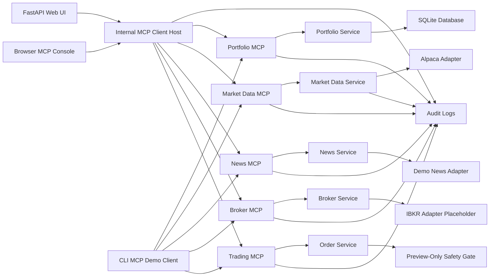
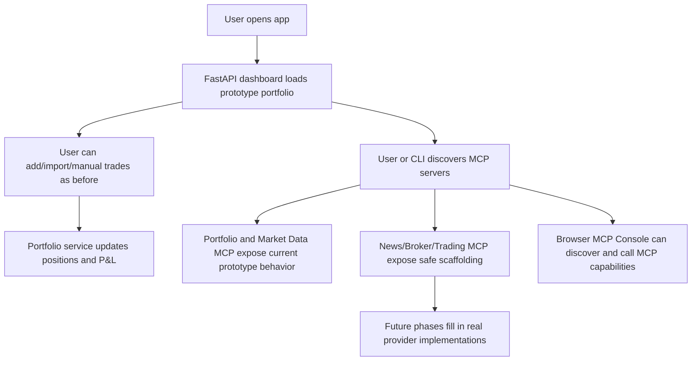
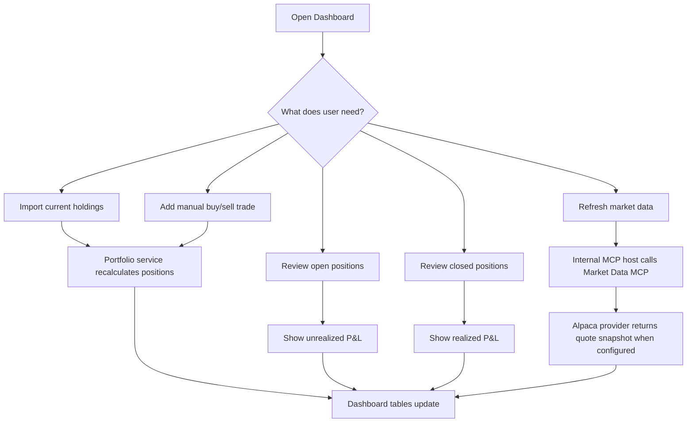
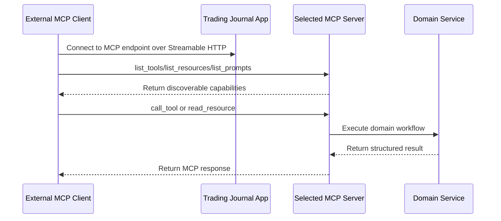
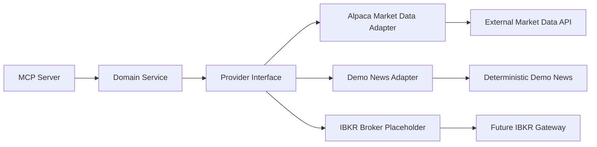
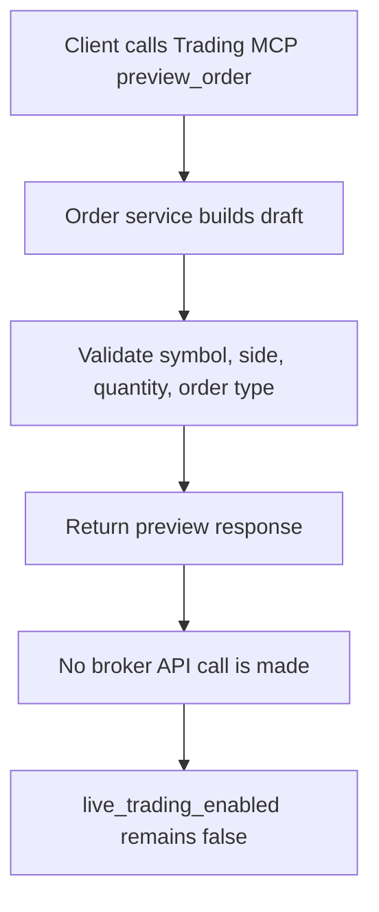
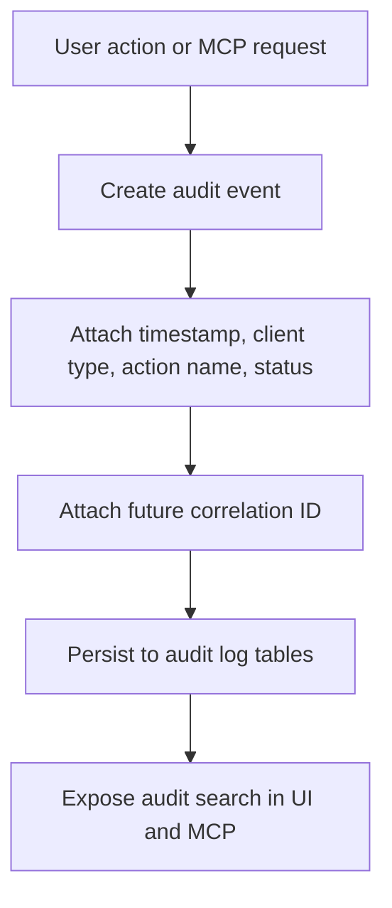

# Trading Journal MCP Architecture Plan

## 1. Step 2 And Step 3 Architecture Outcome

Step 2 adds architecture around the accepted prototype without restarting the project. The current working behavior remains in place, but the code now has clearer boundaries for future MCP servers, external providers, services, audit logging, broker sync, news, and order workflows.

Step 3 starts moving code gradually into those boundaries. The first migration moves FastAPI route logic out of `app/main.py` and into dedicated route modules while preserving every existing URL, API endpoint, and MCP endpoint.

The key design decision is to keep the application modular:

- FastAPI app assembly lives in `app/main.py`.
- Web routes and JSON API routes live in `app/routes/`.
- Services own business workflows.
- Providers own external API/broker integration boundaries.
- MCP servers expose domain capabilities to internal and external clients.
- The browser MCP Console and CLI remain separate MCP client demonstrations.

## 2. Current Expanded MCP Topology



## 3. Code Boundaries Added

### 3.1 MCP Server Package

New package:

- `app/mcp_servers/`

Purpose:

- Keep MCP server definitions separated by domain.
- Avoid growing one large MCP file.
- Make it easy to mount or deploy MCP servers independently later.

Current files:

- `app/mcp_servers/portfolio.py`
- `app/mcp_servers/market_data.py`
- `app/mcp_servers/news.py`
- `app/mcp_servers/broker.py`
- `app/mcp_servers/trading.py`
- `app/mcp_servers/security.py`

Compatibility wrappers remain:

- `app/mcp_server.py`
- `app/market_data_mcp.py`

These wrappers preserve existing imports while the application moves toward the new structure.

### 3.2 Provider Package

New package:

- `app/providers/`

Purpose:

- Define interfaces for external systems.
- Keep provider-specific code away from the web routes.
- Allow provider replacement without rewriting app workflows.

Current provider areas:

- `app/providers/market_data/`
- `app/providers/news/`
- `app/providers/broker/`

Current adapters:

- `AlpacaMarketDataProvider`
- `DemoNewsProvider`
- `IBKRBrokerProvider` placeholder

### 3.3 Service Layer Expansion

New service files:

- `app/services/news.py`
- `app/services/broker.py`
- `app/services/orders.py`

Purpose:

- Keep domain workflow logic outside route functions.
- Allow MCP servers and web routes to reuse the same business logic.
- Keep future broker and trading work behind safe service boundaries.

### 3.4 Audit Package

New package:

- `app/audit/`

Purpose:

- Establish a shared audit event shape before persistence is added.
- Prepare for correlation IDs, user action logs, MCP request logs, external API logs, and trading-sensitive audit events.

Current files:

- `app/audit/context.py`
- `app/audit/events.py`
- `app/audit/middleware.py`
- `app/audit/service.py`

Current audit tables:

- `user_action_logs`
- `mcp_request_logs`
- `external_api_call_logs`
- `application_event_logs`

Current audit screens and APIs:

- `/audit`
- `/api/audit/logs`

### 3.5 Route Package

New package:

- `app/routes/`

Purpose:

- Keep HTTP route definitions separate from application startup.
- Preserve existing URLs while making route groups easier to test and extend.
- Let future audit middleware, authentication, and API versioning be added without crowding `app/main.py`.

Current files:

- `app/routes/web.py`
- `app/routes/api.py`

`app/main.py` now focuses on app construction, template/static setup, router inclusion, database startup, and MCP server mounting.

## 4. Active MCP Endpoints

The app now mounts these MCP endpoints:

- `/mcp/`
- `/market-data-mcp/`
- `/news-mcp/`
- `/broker-mcp/`
- `/trading-mcp/`

The first two are functional prototype servers. The last three are safe architectural scaffolds:

- News MCP uses deterministic demo news data.
- Broker MCP reports IBKR is not configured yet.
- Trading MCP supports preview-only architecture and reports live trading disabled.

## 5. Current Safety Boundary

The expanded architecture intentionally does not implement real broker trading yet.

Safety rules currently preserved:

- No live trading.
- No real IBKR order placement.
- No broker credential storage.
- No automatic AI-driven trades.
- Trading MCP reports `live_trading_enabled=false`.
- Order preview is architecture-only.

## 6. Workflow After Step 2



## 7. Why This Is Still MCP-Centered

This architecture makes the application a stronger MCP use case because each financial domain is exposed as a discoverable MCP server:

- Portfolio state and journal workflows.
- Market-data access.
- Stock-news access.
- Broker sync.
- Trading/order preview.

An external MCP client can now discover the system as a multi-domain application instead of a single portfolio endpoint. This mirrors how real AI-enabled software would connect to many data and action sources through MCP.

## 8. Detailed Workflow Charts

### 8.1 Day-to-Day User Workflow



### 8.2 External MCP Client Workflow



### 8.3 Provider Adapter Workflow



### 8.4 Safe Trading Preview Workflow



### 8.5 Audit Workflow



## 9. Roadmap Progress Snapshot

| Roadmap Area | Status | Current Notes |
|---|---:|---|
| 1. Prototype freeze and baseline | Mostly complete | Prototype docs and behavior are preserved |
| 2. Architecture hardening | Partially complete | MCP modules, providers, route modules, and audit package exist |
| 3. Full audit logging and observability | Partially complete | Persistent tables, middleware, MCP logs, redaction, and viewer exist |
| 4. Portfolio and journal core improvements | Partially complete | Manual trade/holding/P&L flows exist; richer journal screens pending |
| 5. Market Data MCP V2 | Partially complete | Alpaca-backed MCP path exists; snapshot persistence pending |
| 6. News MCP Server | Scaffolded only | Demo news provider exists; real news API/UI pending |
| 7. IBKR Broker MCP Server | Scaffolded only | Status scaffolding exists; real IBKR sync pending |
| 8. Order staging and preview | Partially complete | Safe `preview_order` exists; ticket database/UI pending |
| 9. Paper trading | Not started | No paper submission yet |
| 10. Live trading safety gate | Not started | Live trading remains disabled |
| 11. MCP learning console V2 | Partially complete | Browser MCP Console can discover/call/read/render |
| 12. Reports, exports, and review workflows | Early partial | Dashboard P&L exists; exports/trends pending |
| 13. Deployment readiness | Planning only | Deployment plan exists; public deployment pending |

## 10. Verification

The test suite now includes architecture coverage for the expanded MCP topology.

Current verification command:

```bash
python3 -m pytest
```

Current passing baseline:

```text
13 passed
```
