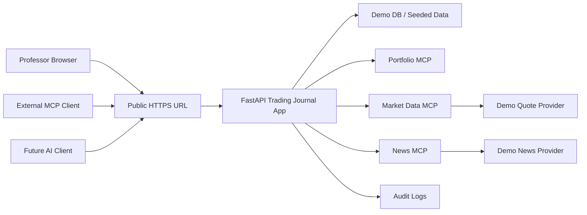
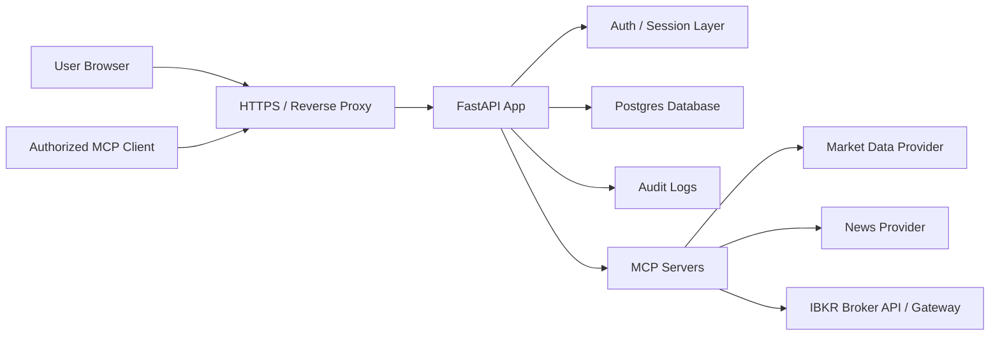

# Trading Journal MCP Deployment Plan

## 1. Deployment Goal

The application should support two deployment paths:

1. Local-first personal deployment for daily use.
2. Simple public demo deployment for professor/class review.

The local-first deployment is the main application path because it is safer for real portfolio data, broker sessions, API keys, audit logs, and future trade execution. The public demo deployment is only for review and should use sample data, read-only or paper-trading mode, and public MCP endpoints that external clients can discover.

## 2. Recommended Two-Option Plan

### Option 1: Local-First Personal Deployment

This is the recommended path for the real day-to-day application.

Purpose:

- Run the real Trading Journal on the user's own machine.
- Keep broker/API credentials local.
- Keep private trading journal data local.
- Use localhost MCP endpoints for learning, testing, and private AI/client integration.
- Later allow controlled remote access through VPN, tunnel, or a private hosted deployment.

Local endpoints:

- Web UI: `http://127.0.0.1:8000/`
- Portfolio MCP endpoint: `http://127.0.0.1:8000/mcp/`
- Market Data MCP endpoint: `http://127.0.0.1:8000/market-data-mcp/`
- Future News MCP endpoint: `http://127.0.0.1:8000/news-mcp/`
- Future Broker MCP endpoint: `http://127.0.0.1:8000/broker-mcp/`
- Future Trading MCP endpoint: `http://127.0.0.1:8000/trading-mcp/`

Benefits:

- Safest option for real financial data.
- Easiest to connect with local broker tools such as IBKR Gateway or TWS.
- Avoids exposing live trading tools to the internet.
- Lower cost.
- Better for development and testing.

Limitations:

- Professor or external clients cannot access it unless screen sharing, a secure tunnel, or a public demo environment is used.
- Requires the user's computer to be running.
- Remote access must be designed carefully before real credentials are involved.

Recommended usage:

- Use this for real personal portfolio tracking.
- Use real broker/API keys only in local mode at first.
- Keep live trading disabled until the safety gate is complete.
- Use local MCP console and CLI for development demos.

### Option 2: Simple Public Demo Deployment

This is the recommended path for professor review.

Purpose:

- Give the professor a public HTTPS URL.
- Let them explore the web UI independently.
- Let external MCP clients connect to safe public MCP endpoints.
- Demonstrate architecture without exposing real broker credentials or personal portfolio data.

Public demo endpoints:

- Web UI: `https://demo-domain.example/`
- Portfolio MCP endpoint: `https://demo-domain.example/mcp/`
- Market Data MCP endpoint: `https://demo-domain.example/market-data-mcp/`
- Future News MCP endpoint: `https://demo-domain.example/news-mcp/`
- Future Broker MCP endpoint: `https://demo-domain.example/broker-mcp/`
- Future Trading MCP endpoint: `https://demo-domain.example/trading-mcp/`

Benefits:

- Easy for professor/class review.
- No need for professor to install anything.
- Good live demonstration of MCP as remote HTTP endpoints.
- Can be reset with seeded demo data.

Limitations:

- Should not use real broker credentials.
- Should not allow live trading.
- Free hosting may sleep or reset data.
- Public MCP endpoints need token/login protection.

Recommended usage:

- Use Render Free Web Service first because it is easy to set up.
- Use demo/sample data only.
- Enable audit logging.
- Disable live trading.
- Use fake/simulated quote, news, broker, and order providers where useful.

## 3. What Must Be Publicly Accessible

The deployed app should expose:

- Web UI: `https://demo-domain.example/`
- Portfolio MCP endpoint: `https://demo-domain.example/mcp/`
- Market Data MCP endpoint: `https://demo-domain.example/market-data-mcp/`
- Future News MCP endpoint: `https://demo-domain.example/news-mcp/`
- Future Broker MCP endpoint: `https://demo-domain.example/broker-mcp/`
- Future Trading MCP endpoint: `https://demo-domain.example/trading-mcp/`

The MCP remote server requirement is important: a remote MCP server must be publicly reachable at its configured URL. Streamable HTTP is the recommended remote transport path.

## 4. Demo Safety Requirements

For a professor-accessible demo:

- Use sample/demo portfolio data by default.
- Do not store real broker credentials on the demo server.
- Disable live trading.
- Allow only paper trading or simulated order workflows.
- Use read-only MCP access unless a demo token is provided.
- Clearly show a banner such as `DEMO MODE - No live trading`.
- Seed/reset demo data on demand.
- Redact all secrets from logs.
- Keep audit logging enabled so MCP calls and UI actions can be demonstrated.

## 5. Free Deployment Options First

### Option A: Render Free Web Service

Render is the best first free demo option because it supports Python web services, managed TLS, public URLs, logs, and a straightforward Git-based deployment flow.

Pros:

- Simple FastAPI deployment.
- Public HTTPS URL.
- Free web services are available.
- Free managed TLS certificates.
- Good fit for a professor demo.

Limitations:

- Free web services spin down after idle time.
- Startup after spin-down can take about a minute.
- Local filesystem is ephemeral, so SQLite data can be lost on restart/redeploy/spin-down.
- Free Render Postgres exists, but free databases expire after 30 days.
- Not suitable for production trading.

Recommended usage:

- Use Render for the first public professor demo.
- Run in demo mode.
- Seed demo data on startup.
- Use free Postgres only if the demo needs data persistence during a short review window.
- Otherwise use SQLite with startup seed data and accept reset behavior.

### Option B: Koyeb Free Instance

Koyeb is another good free web-service option.

Pros:

- Public web service deployment.
- Free instance available.
- Free instance includes small compute and SSD allocation.
- One free PostgreSQL database is available with limitations.

Limitations:

- One free instance per organization.
- Free instance scales to zero after idle time.
- Free instances cannot use volumes for persistent storage.
- Free PostgreSQL has limited active time.
- Better for demos than production.

Recommended usage:

- Use as an alternative if Render is unavailable or inconvenient.
- Run in demo mode with seeded data.

### Option C: Hugging Face Spaces

Hugging Face Spaces can host public demo apps and supports free CPU hardware.

Pros:

- Public URL.
- Free CPU Basic hardware.
- Easy for demos and academic sharing.
- Docker-based deployments are possible.

Limitations:

- Default disk is not persistent.
- More natural for Gradio/Streamlit demos than a full FastAPI trading app.
- App sleep/startup behavior and routing should be tested with MCP endpoints.

Recommended usage:

- Good for a visual demo or simplified version.
- Use only after confirming FastAPI and MCP endpoints behave correctly behind the Spaces proxy.

### Option D: PythonAnywhere Free Account

PythonAnywhere is Python-friendly and useful for simple class demos.

Pros:

- Free beginner account.
- Python-focused hosting.
- Public `username.pythonanywhere.com` URL.

Limitations:

- Free accounts have restricted outbound internet access.
- Free accounts have limited CPU/disk.
- Free web app may expire after one month.
- ASGI/FastAPI support and MCP Streamable HTTP behavior should be validated.

Recommended usage:

- Consider only for a very simple demo.
- Not recommended for live market data, broker APIs, or long-term MCP testing.

### Option E: Oracle Cloud Always Free

Oracle Cloud Always Free is the strongest zero-cost long-term option, but it requires more setup.

Pros:

- Always Free compute options.
- More control over Docker, Nginx, TLS, database, and networking.
- Better for a long-running public demo than services that sleep.

Limitations:

- More DevOps work.
- Account setup and cloud networking can be confusing.
- Free capacity may vary by region.
- Need to manage server security yourself.

Recommended usage:

- Best free long-term hosting path after the first simple demo.
- Use Docker Compose, Nginx/Caddy, HTTPS, and a persistent database.

### Option F: Google Cloud Run Free Tier

Google Cloud Run has a generous free tier for requests, CPU, and memory, and is a strong technical option.

Pros:

- Scales to zero.
- Public HTTPS service.
- Good for containerized FastAPI.
- Professional deployment path.

Limitations:

- Usually requires a billing account.
- Persistent database is separate.
- Cold starts can happen.
- More cloud setup than Render.

Recommended usage:

- Good second-stage option if a billing account is acceptable.
- Pair with a managed database or demo seed data.

### Option G: Railway

Railway is developer-friendly, but it should be treated as low-cost rather than truly free for our purpose.

Pros:

- Easy deployment.
- Supports services, environment variables, and volumes.
- Good developer experience.

Limitations:

- Free offering is limited.
- Current public pricing describes a small free credit/trial model and a paid Hobby plan.
- Better as a low-cost option than a reliable free option.

Recommended usage:

- Consider if paying around a few dollars per month is acceptable.
- Not the first recommendation for a strict free demo.

## 6. Recommended Demo Deployment Path

Recommended first choice: Render Free Web Service.

Recommended backup: Koyeb Free Instance.

Recommended long-term free option: Oracle Cloud Always Free.

For the first professor demo, use this approach:

1. Add a `DEMO_MODE=true` setting.
2. Add seeded sample accounts, trades, positions, news, and quote snapshots.
3. Disable live broker trading completely.
4. Keep MCP endpoints public but protected by a simple demo token or login.
5. Add a visible `Demo Mode` banner.
6. Deploy the FastAPI app to Render.
7. Provide the professor with:
   - Web app URL.
   - MCP endpoint URLs.
   - Demo login or demo MCP bearer token.
   - Suggested demo script.

## 7. Deployment Architecture for Demo

## 8. Deployment Architecture for Future Production

## 9. App Changes Needed Before Public Demo

Required before deployment:

- Add `DEMO_MODE` configuration.
- Add startup demo-data seeding.
- Add `ENABLE_LIVE_TRADING=false` default.
- Add environment-based settings for public base URL and allowed hosts.
- Add simple login or bearer-token protection for MCP endpoints.
- Add CORS/origin rules for the public domain.
- Add health endpoint, such as `/health`.
- Add deployment start command, such as `uvicorn app.main:app --host 0.0.0.0 --port $PORT`.
- Add `render.yaml` or provider-specific deployment notes.
- Add demo reset command or route protected by admin/demo token.

Recommended before deployment:

- Add audit log viewer.
- Add sample MCP client configuration.
- Add professor demo script.
- Add read-only mode for public demo.
- Add fake/simulated market-data and news providers so the demo does not depend on external API limits.

## 10. MCP Security Plan for Remote Access

For local development, MCP can run on localhost. For public deployment, MCP endpoints need stronger controls.

Minimum demo controls:

- HTTPS only.
- Allowed host/origin configuration.
- Bearer token or login-protected MCP calls.
- Read-only MCP tools by default.
- Trading tools disabled in demo.
- Audit every MCP request.

Long-term controls:

- OAuth 2.1-compatible authorization for HTTP MCP transport.
- Scoped access tokens.
- Separate read-only, journal-write, broker-sync, and trading scopes.
- Human approval gate for trading-sensitive MCP tools.
- Rate limiting.
- Per-client audit logs.

## 11. External Client Demo Options

For professor review, provide at least three access paths:

1. Web UI demo:
   - Professor opens the public URL and explores dashboard, trades, positions, news, market data, MCP console, and audit logs.

2. Browser-based MCP console:
   - Professor clicks MCP Console.
   - Discovers tools/resources/prompts.
   - Calls safe read-only tools.
   - Views raw request/response and audit logs.

3. External CLI MCP client:
   - Run the included CLI against the public base URL.
   - Example future command:
     `python3 scripts/mcp_demo_client.py --base-url https://demo-domain.example discover`

Future AI client:

- Connects to the public MCP endpoint.
- Uses a token or OAuth flow.
- Discovers tools/resources/prompts.
- Calls only allowed tools based on its access scope.

## 12. Recommended Implementation Order

Local-first track:

1. Keep the real app running locally for private use.
2. Add audit logging, MCP console, and broker-safe configuration locally first.
3. Add real broker/API credentials only to the local environment.
4. Use local MCP endpoints for development and private client testing.
5. Consider secure remote access later through VPN, private tunnel, or authenticated deployment.

Public demo track:

1. Add demo mode and seed data.
2. Add health endpoint and deployment start command.
3. Add public-base-url configuration.
4. Update MCP client script to accept `--base-url`.
5. Add simple MCP bearer-token protection for demo.
6. Add Render deployment config.
7. Test locally with production-like command.
8. Deploy to Render.
9. Run web UI demo.
10. Run MCP CLI against public URL.
11. Add professor demo instructions.

## 13. Sources Reviewed

- MCP remote servers: https://modelcontextprotocol.io/registry/remote-servers
- MCP Streamable HTTP transport: https://modelcontextprotocol.io/specification/2025-06-18/basic/transports
- MCP authorization: https://modelcontextprotocol.io/specification/2025-06-18/basic/authorization
- Render free deployments: https://render.com/docs/free
- Render compute plans: https://render.com/docs/compute-plans
- Koyeb free instances: https://www.koyeb.com/docs/reference/instances
- Koyeb pricing FAQ: https://www.koyeb.com/docs/faqs/pricing
- Hugging Face Spaces overview: https://huggingface.co/docs/hub/spaces-overview
- PythonAnywhere pricing: https://www.pythonanywhere.com/pricing/
- PythonAnywhere free account features: https://help.pythonanywhere.com/pages/FreeAccountsFeatures
- Oracle Cloud Free Tier: https://www.oracle.com/cloud/free/
- Oracle Always Free resources: https://docs.oracle.com/en-us/iaas/Content/FreeTier/freetier_topic-Always_Free_Resources.htm
- Google Cloud Run pricing/free tier: https://cloud.google.com/run/pricing
- Railway pricing: https://railway.com/pricing
