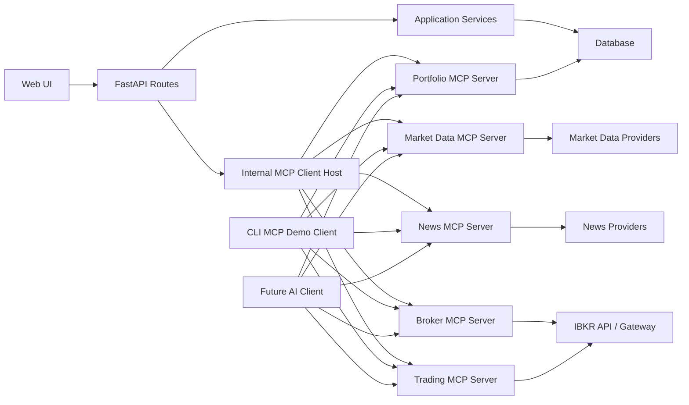

# Trading Journal MCP Application Implementation Plan

## 1. Implementation Approach

The current application is the accepted prototype. The next work should convert it into the real Trading Journal MCP application in controlled milestones. The safest approach is to build from low-risk capabilities toward high-risk capabilities:

1. Stabilize architecture, database models, logging, and test structure.
2. Improve portfolio and journal workflows.
3. Add news and richer market data.
4. Add broker account sync.
5. Add order staging and paper trading.
6. Add live trading only after confirmation, audit, and reconciliation are reliable.

This sequence matters because live trading should not be added until the app can explain what happened, store every important event, and recover cleanly from provider or broker errors.

## 2. Target Architecture

## 3. Phase 0: Prototype Freeze and Baseline

Goal: preserve the accepted prototype behavior before larger changes begin.

Deliverables:

- Confirm current tests pass.
- Create a baseline note describing current features in `docs/prototype_baseline.md`.
- Keep prototype routes usable while adding new architecture.
- Avoid breaking manual Fidelity holding import and manual trade entry.

Implementation tasks:

- Run existing test suite.
- Add a `docs/prototype_baseline.md` summary if needed.
- Review current database initialization behavior.
- Identify any prototype-only shortcuts that must be replaced later.

Acceptance criteria:

- Existing dashboard, trade entry, positions, market data, and MCP CLI demo still work.
- Existing tests pass.
- No live trading code exists yet.

## 4. Phase 1: Architecture Hardening

Goal: create the real application foundation without changing user-facing workflows too much.

Current Step 2 progress is documented in `docs/architecture_plan.md`.

Deliverables:

- Clear folder structure for services, providers, MCP servers, and schemas.
- Database models for the real application.
- Migration or schema upgrade strategy.
- Centralized configuration.
- Domain errors and result objects.

Recommended module structure:

- `app/models/`: database entities.
- `app/schemas/`: request/response schemas, split by domain.
- `app/services/portfolio.py`: portfolio and P&L business logic.
- `app/services/journal.py`: trade reasons, reviews, lessons learned.
- `app/services/market_data.py`: market-data orchestration.
- `app/services/news.py`: news orchestration.
- `app/services/broker.py`: broker sync orchestration.
- `app/services/orders.py`: order staging, preview, status, reconciliation.
- `app/providers/market_data/`: Alpaca and IBKR market-data providers.
- `app/providers/news/`: Polygon, Finnhub, Alpha Vantage, or NewsAPI provider.
- `app/providers/broker/`: IBKR provider.
- `app/mcp_servers/`: separate MCP server modules by domain.
- `app/audit/`: audit logging, redaction, correlation IDs.

Implementation tasks:

- Refactor existing large modules only where needed.
- Add models for `BrokerConnection`, `OrderTicket`, `OrderEvent`, `NewsArticle`, `MarketQuoteSnapshot`, `JournalEntry`, `PositionReview`, `BrokerSyncRun`, `UserActionLog`, `MCPRequestLog`, `ExternalAPICallLog`, and `ApplicationEventLog`.
- Add enums for order status, order type, time in force, provider status, event type, and client type.
- Add a database migration approach. For local development, this can initially be a safe schema creation/upgrade helper, but Alembic is recommended before deployment.

Acceptance criteria:

- Application starts with the expanded schema.
- Old prototype data is not destroyed.
- Existing screens still work.
- New models have basic tests.

## 5. Phase 2: Full Audit Logging and Observability

Goal: log every useful detail happening in the app while protecting secrets.

Deliverables:

- Central audit logging service.
- Correlation ID for each user request and MCP workflow.
- Persistent audit tables.
- Developer/admin audit log screen.
- Exportable audit log data.

Implementation tasks:

- Add request middleware that creates or propagates a correlation ID.
- Log page views for dashboard, trades, positions, market data, news, orders, and MCP console.
- Log API requests and outcomes.
- Log MCP client requests, server discovery, tool calls, resource reads, prompt calls, response status, duration, and errors.
- Log external API calls for market data, news, and broker providers.
- Add redaction helpers for API keys, tokens, cookies, account credentials, and sensitive payload fields.
- Add audit viewer page with filters by event type, client type, symbol, account, status, and correlation ID.

Acceptance criteria:

- A user can open the audit screen and see recent app actions.
- MCP CLI calls create MCP request logs.
- External market-data calls create external API logs.
- Sensitive values are redacted in stored logs.
- Tests prove redaction works.

## 6. Phase 3: Portfolio and Journal Core

Goal: make the everyday journal experience strong before adding broker trading.

Deliverables:

- Improved account management.
- Improved instrument management.
- Better trade entry and close-position workflow.
- Post-trade review support.
- Better P&L reporting and filters.
- Modern UI refresh with a polished cool/cold theme and consistent design system.

Implementation tasks:

- Add account create/edit screens.
- Add account type field.
- Add instrument detail page.
- Add symbol normalization and broker contract metadata fields.
- Add journal entry model and UI.
- Add position review model and UI.
- Add exit reason and lessons learned fields for closed positions.
- Add filters for trades and positions by account, asset class, symbol, date range, status, and origin.
- Add CSV export for trades and closed positions.
- Redesign the UI using a modern cold palette with slate, steel blue, ice gray, teal, and crisp white accents.
- Improve financial table styling with sticky headers where useful, aligned numbers, clear gains/losses, and compact scanning.
- Create reusable styles/components for cards, tables, forms, buttons, badges, alerts, and navigation.

Acceptance criteria:

- User can manage accounts without editing the database manually.
- User can add entry reason, exit reason, and review notes.
- Closed positions show realized P&L percentage and review notes.
- Dashboard tables support the required account/account-type/asset-class breakdowns.
- UI feels modern, consistent, readable, and suitable for daily trading review.

## 7. Phase 4: Market Data MCP Server V2

Goal: turn market data into a robust MCP-backed subsystem.

Deliverables:

- Provider interface for market data.
- Alpaca provider retained.
- IBKR market-data provider added when broker connectivity is ready.
- Quote snapshot storage.
- Quote freshness and entitlement status shown in UI.
- MCP tools/resources/prompts expanded.

Implementation tasks:

- Define `MarketDataProvider` interface.
- Move Alpaca-specific code into `app/providers/market_data/alpaca.py`.
- Add quote snapshot persistence.
- Add quote status labels: live, delayed, end-of-day, manual, unavailable.
- Add `get_quote`, `get_quotes`, `get_price_history`, and `refresh_open_position_marks` MCP tools.
- Add `market-data://quote/{symbol}` and `market-data://capabilities` resources.
- Add provider failure logging.

Acceptance criteria:

- Market data page displays quote status and timestamp.
- Open position refresh stores quote snapshots.
- MCP client can fetch single-symbol and batch quotes.
- Provider failures appear in UI and audit logs.

## 8. Phase 5: News MCP Server

Goal: add stock news and make it visible both in the UI and through MCP.

Deliverables:

- News provider interface.
- First news provider implementation.
- Symbol news page.
- Portfolio news page.
- News MCP server.
- News caching and audit logs.

Recommended V1 provider:

- Start with Finnhub or Alpha Vantage if the user wants a simpler free-tier setup.
- Use Polygon if the user already has or wants a richer market-data/news provider.

Implementation tasks:

- Define `NewsProvider` interface.
- Add provider config and API key handling.
- Add `NewsArticle` model.
- Add `/news` portfolio news page.
- Add `/news/{symbol}` symbol detail page.
- Add tools: `get_news_capabilities`, `get_symbol_news`, `get_portfolio_news`, `get_news_sentiment`.
- Add resources: `news://portfolio`, `news://symbol/{symbol}`.
- Add prompt: `portfolio_news_review`.
- Add caching to avoid repeated provider calls.

Acceptance criteria:

- User can view latest news for open positions.
- User can view news for a selected symbol.
- MCP client can retrieve news through News MCP.
- News API failures are logged and displayed clearly.

## 9. Phase 6: Broker MCP Server for IBKR Sync

Goal: connect to IBKR for read-only broker data before allowing any trading.

Deliverables:

- IBKR provider.
- Broker connection status screen.
- Broker account discovery.
- Position sync.
- Execution sync.
- Broker MCP server.
- Broker sync audit trail.

Implementation tasks:

- Decide IBKR connection path: Web API/Gateway or TWS API.
- Add broker configuration fields.
- Implement `get_broker_status`.
- Implement `list_broker_accounts`.
- Implement `sync_accounts`.
- Implement `sync_positions`.
- Implement `sync_executions`.
- Store broker external IDs for accounts, contracts, positions, executions, and orders.
- Make sync idempotent.
- Add broker sync screen with last sync status.

Acceptance criteria:

- App can show IBKR connection status.
- App can list available broker accounts.
- App can sync positions without creating duplicates.
- App can sync executions without creating duplicates.
- All broker calls are logged with correlation IDs and redacted payloads.

## 10. Phase 7: Order Staging and Preview

Goal: support trade planning and broker order preview without placing live orders.

Deliverables:

- Order ticket database model.
- Order staging UI.
- Order preview UI.
- Trading MCP tools for safe preview/staging.
- Paper/sandbox mode clearly shown.

Implementation tasks:

- Add order ticket form.
- Require trade reason on every order ticket.
- Require risk notes for live order candidates.
- Add order type, limit price, time in force, and estimated value.
- Validate quantity, symbol/contract, order type, account, and market session where possible.
- Add `stage_order` MCP tool.
- Add `preview_order` MCP tool.
- Store preview result and broker validation response.
- Add audit records for every staged and previewed order.

Acceptance criteria:

- User can stage an order without submitting it.
- User can preview an order.
- Order preview cannot accidentally submit an order.
- MCP client can stage and preview orders.
- Audit log clearly shows staged/previewed status.

## 11. Phase 8: Paper Trading

Goal: allow order submission only in paper/sandbox mode.

Deliverables:

- Paper order submission.
- Order status updates.
- Fill reconciliation.
- Order event timeline.

Implementation tasks:

- Add `submit_paper_order` MCP tool.
- Add paper order submit button.
- Store broker order ID.
- Poll or refresh order status.
- Store order events.
- Reconcile fills into trades.
- Update positions and P&L from fills.

Acceptance criteria:

- Paper order can be submitted safely.
- Order status is visible.
- Filled paper orders create journal trades.
- Trade reason is preserved from the order ticket.
- No live order route/tool is active by default.

## 12. Phase 9: Live Trading Safety Gate

Goal: add live trading only after paper trading and audit logs are reliable.

Deliverables:

- Live trading feature flag.
- Human confirmation screen.
- Strong visual warnings.
- Live order submission with audit trail.
- Live order cancellation with audit trail.

Implementation tasks:

- Add `ENABLE_LIVE_TRADING=false` default.
- Add confirmation token or two-step confirmation flow.
- Require exact confirmation text before live submission.
- Add `submit_live_order` MCP tool behind approval guard.
- Add `cancel_order` MCP tool behind approval guard for live orders.
- Store user approval/denial audit events.
- Store broker response and order lifecycle.

Acceptance criteria:

- Live trading is impossible unless explicitly enabled.
- MCP client cannot submit live order without user approval.
- UI clearly shows paper vs live.
- Tests prove live trading guard blocks unauthorized requests.

## 13. Phase 10: MCP Learning Console V2

Goal: make MCP behavior easy to demonstrate without relying only on terminal commands.

Deliverables:

- Web-based MCP console.
- Multi-server discovery screen.
- Tool/resource/prompt explorer.
- Request/response viewer.
- Guided demo workflows.

Implementation tasks:

- Expand existing `/mcp-console`.
- Add tabs for Portfolio, Market Data, News, Broker, and Trading MCP servers.
- Show available tools, input schemas, resources, and prompts.
- Let user enter JSON arguments and call tools.
- Display structured result and raw MCP response.
- Link every console action to audit log entries.
- Add guided demo buttons for daily portfolio review, market-data check, news review, broker sync check, and order preview.

Acceptance criteria:

- User can demonstrate MCP discovery from the browser.
- User can call read-only MCP tools from the browser.
- User can see raw request/response flow.
- Audit log connects the console action to the MCP server/tool.

## 14. Phase 11: Reports, Exports, and Review Workflows

Goal: make the app useful for real day-to-day review.

Deliverables:

- Daily review page.
- Weekly/monthly performance reports.
- Journal quality report.
- Trade export.
- Audit export.

Implementation tasks:

- Add date-based P&L report.
- Add realized/unrealized P&L trend.
- Add win/loss report for closed positions.
- Add journal review completeness report.
- Add CSV export for trades, positions, closed positions, news snapshots, and audit logs.
- Add MCP prompts for daily and weekly review.

Acceptance criteria:

- User can review performance over time.
- User can export records.
- User can identify trades missing useful journal context.

## 15. Phase 12: Deployment Readiness

Goal: keep the real application local-first for safe personal use, while also preparing a simple public demo deployment for professor review.

Deliverables:

- Local-first deployment/run mode for the real app.
- Free-first professor demo deployment plan.
- Authentication.
- Secure sessions.
- Production configuration.
- Database migration path.
- Backup/export strategy.

Implementation tasks:

- Follow `docs/deployment_plan.md` for the public demo path.
- Keep local deployment as the primary path for real portfolio data, broker credentials, and future trading.
- Add demo mode with seeded sample data.
- Add health endpoint and production-style start command.
- Add public base URL configuration.
- Update the MCP CLI client to target a remote base URL.
- Add simple demo authentication or MCP bearer-token protection before public access.
- Deploy first to a free demo host such as Render or Koyeb.
- Add login.
- Add user profile.
- Add authorization checks.
- Move secrets to proper deployment secret storage.
- Add HTTPS deployment plan.
- Move from SQLite to Postgres if needed.
- Add backup and restore flow.
- Add deployment documentation.

Acceptance criteria:

- Real personal use can continue locally without exposing private data or broker credentials publicly.
- Professor can access the app through a public HTTPS URL.
- External MCP or AI clients can reach safe public MCP endpoints.
- Demo environment uses sample data, read-only/simulated broker behavior, and disabled live trading.
- App can be deployed without hardcoded secrets.
- User data is protected.
- Trading actions remain confirmation-gated.
- Database can be backed up and restored.

## 16. Cross-Cutting Testing Plan

Every phase should include tests.

Required test groups:

- Portfolio accounting tests.
- Trade entry validation tests.
- Position close tests.
- P&L report tests.
- Audit redaction tests.
- MCP discovery tests.
- MCP tool call tests.
- Market-data provider mock tests.
- News provider mock tests.
- Broker provider mock tests.
- Order preview safety tests.
- Paper trading tests.
- Live trading guard tests.

Testing rule:

- External providers and broker APIs should be mocked in automated tests.
- Real provider calls should be limited to manual integration tests.
- Live trading must never run in automated tests.

## 17. Risk Management

Major risks and mitigations:

- Broker API complexity: implement read-only sync first.
- Live trading danger: keep disabled by default and require explicit confirmation.
- Market-data entitlement limits: show provider/feed/freshness clearly.
- News API rate limits: cache responses.
- Database migration risk: add migrations before heavy model changes.
- MCP complexity: keep each MCP server focused and provide a browser-based learning console.
- Sensitive log data: enforce redaction before saving audit records.

## 18. Recommended Immediate Next Step

The next implementation step should be **Phase 1 plus Phase 2 foundation**:

1. Add the audit/event models and logging service.
2. Add correlation ID middleware.
3. Add basic audit logging for page views, manual trades, MCP calls, and market-data calls.
4. Add an audit log viewer page.
5. Add tests for audit creation and secret redaction.

This gives us the foundation needed for every later phase, especially broker sync and trading.

For public professor review, the first deployment step should be the free-first demo deployment path in `docs/deployment_plan.md`, but only after demo mode, seeded data, safe MCP access, and disabled live trading are in place.
